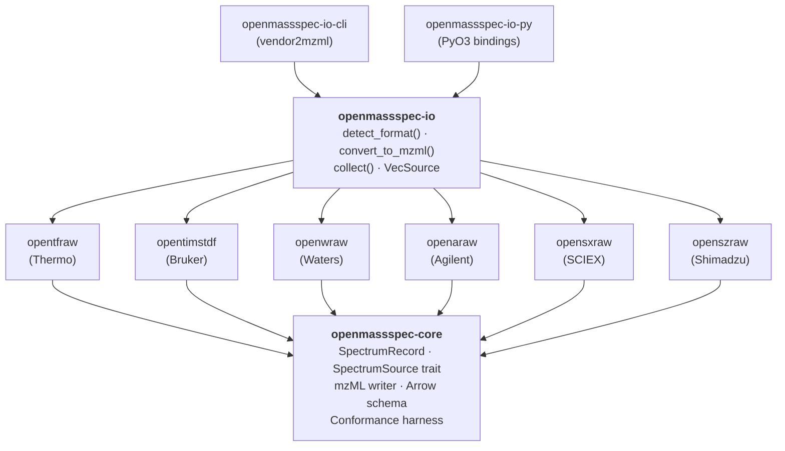

# Architecture

Each arrow is a Cargo dependency edge (`A --> B` means "A depends on
B"). Every vendor crate depends on `openmassspec-core` and nothing
else in the stack; `openmassspec-io` is the only crate that depends on
more than one vendor crate at a time.

## Layering rules

- **`openmassspec-core` knows nothing about vendors.** It owns the
  shared schema, the mzML byte format, the Arrow layout, and the
  conformance harness. Anything generic enough to be shared between
  Thermo / Bruker / Waters / Agilent / SCIEX / Shimadzu lives here.
- **Vendor crates know nothing about each other.** Each implements
  `SpectrumSource` and a `write_mzml(path, writer)` helper. They
  depend on `openmassspec-core` and zero other vendor crates.
- **`openmassspec-io` is the only place that knows the full vendor
  set.** Format detection, dispatch, and feature-gated re-exports
  live here, behind the `thermo`, `bruker`, `waters` features.
- **`openmassspec-io-cli` and `openmassspec-io-py` depend on
  `openmassspec-io`.** They never call vendor crates directly; if they
  need something from a vendor, that something is promoted to the
  umbrella first.

## Streaming model

A `SpectrumSource` exposes `iter_spectra(&mut self) -> Box<dyn
Iterator<Item = SpectrumRecord> + '_>`. Both the mzML writer and the
Arrow batch builder consume this iterator without ever holding more
than a single spectrum in memory at a time (except when the consumer
explicitly buffers, as `--validate` does).

This keeps OpenMassSpec usable for the multi-gigabyte timsTOF runs that
come out of dia-PASEF experiments without requiring temp files or
mmap tricks.
